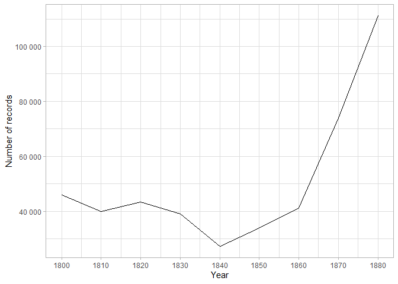

Readme
================

# Mantalsregister 1909

## Purpose

Stockholms city archive have got a nice register of people who were
taxed in Stockholm in 1909 with name, date of birth, address and title.
There are many observations!

It could be interesting to do some geo-coding of this data to look at
how technological change in the labour market resulting in changing
housing patterns - did changing incomes increase segregation, drive up
rental prices etc? Would tie in well with the data that Fredrik will
have. What were the occupational structures like and how much economies
of agglomeration were there?

[Link](https://sok.stadsarkivet.stockholm.se/Databas/mantalsregister-1909/Sok?sidindex=0)

## Source

It is digitized and in a nice table on the website of Stockholm city
archives.

This is what it looks like:

## Data

If you want the data, you can download it as:

    ── Attaching packages ─────────────────────────────────────── tidyverse 1.3.2 ──
    ✔ ggplot2 3.3.6      ✔ purrr   0.3.5 
    ✔ tibble  3.1.8      ✔ dplyr   1.0.10
    ✔ tidyr   1.2.1      ✔ stringr 1.4.1 
    ✔ readr   2.1.3      ✔ forcats 0.5.2 
    ── Conflicts ────────────────────────────────────────── tidyverse_conflicts() ──
    ✖ dplyr::filter() masks stats::filter()
    ✖ dplyr::lag()    masks stats::lag()

    Warning: 12 parsing failures.
       row col expected actual
    260464  -- a number Första
    260465  -- a number Första
    260466  -- a number Första
    260467  -- a number Första
    260468  -- a number Första
    ...... ... ........ ......
    See problems(...) for more details.

<table class="gt_table">
  <thead class="gt_header">
    <tr>
      <td colspan="2" class="gt_heading gt_title gt_font_normal gt_bottom_border" style><strong>Download data</strong></td>
    </tr>
    
  </thead>
  
  <tbody class="gt_table_body">
    <tr><td class="gt_row gt_left"></td>
<td class="gt_row gt_left"><a href = data/export/mantalsregister_data.dta>
Stata format
             </a></td></tr>
    <tr><td class="gt_row gt_left"></td>
<td class="gt_row gt_left"><a href = data/export/mantalsregister_data.csv>
CSV
             </a></td></tr>
    <tr><td class="gt_row gt_left"></td>
<td class="gt_row gt_left"><a href = data/export/mantalsregister_data.rds>
RDS
             </a></td></tr>
  </tbody>
  
  
</table>

## Scraping

The scraper is in in the [code folder](code/03-scraper.qmd).

### Records

<table class="gt_table">
  <thead class="gt_header">
    <tr>
      <td colspan="2" class="gt_heading gt_title gt_font_normal" style>Number of records per year</td>
    </tr>
    <tr>
      <td colspan="2" class="gt_heading gt_subtitle gt_font_normal gt_bottom_border" style>On web portal</td>
    </tr>
  </thead>
  <thead class="gt_col_headings">
    <tr>
      <th class="gt_col_heading gt_columns_bottom_border gt_right" rowspan="1" colspan="1" scope="col">Year</th>
      <th class="gt_col_heading gt_columns_bottom_border gt_right" rowspan="1" colspan="1" scope="col">Number of records</th>
    </tr>
  </thead>
  <tbody class="gt_table_body">
    <tr><td class="gt_row gt_right">1800</td>
<td class="gt_row gt_right">45 838</td></tr>
    <tr><td class="gt_row gt_right">1810</td>
<td class="gt_row gt_right">40 003</td></tr>
    <tr><td class="gt_row gt_right">1820</td>
<td class="gt_row gt_right">43 416</td></tr>
    <tr><td class="gt_row gt_right">1830</td>
<td class="gt_row gt_right">38 953</td></tr>
    <tr><td class="gt_row gt_right">1840</td>
<td class="gt_row gt_right">27 312</td></tr>
    <tr><td class="gt_row gt_right">1850</td>
<td class="gt_row gt_right">33 802</td></tr>
    <tr><td class="gt_row gt_right">1860</td>
<td class="gt_row gt_right">41 264</td></tr>
    <tr><td class="gt_row gt_right">1870</td>
<td class="gt_row gt_right">73 899</td></tr>
    <tr><td class="gt_row gt_right">1880</td>
<td class="gt_row gt_right">111 130</td></tr>
  </tbody>
  
  
</table>

## Summary statistics

My scraped data shows that I have are:

    Joining, by = "year"

<table class="gt_table">
  <thead class="gt_header">
    <tr>
      <td colspan="4" class="gt_heading gt_title gt_font_normal" style>Number of records per year</td>
    </tr>
    <tr>
      <td colspan="4" class="gt_heading gt_subtitle gt_font_normal gt_bottom_border" style>Scraped vs web portal</td>
    </tr>
  </thead>
  <thead class="gt_col_headings">
    <tr>
      <th class="gt_col_heading gt_columns_bottom_border gt_right" rowspan="1" colspan="1" scope="col">Year</th>
      <th class="gt_col_heading gt_columns_bottom_border gt_right" rowspan="1" colspan="1" scope="col">On web portal</th>
      <th class="gt_col_heading gt_columns_bottom_border gt_right" rowspan="1" colspan="1" scope="col">Scraped</th>
      <th class="gt_col_heading gt_columns_bottom_border gt_right" rowspan="1" colspan="1" scope="col">Difference</th>
    </tr>
  </thead>
  <tbody class="gt_table_body">
    <tr><td class="gt_row gt_right">1800</td>
<td class="gt_row gt_right">45 838</td>
<td class="gt_row gt_right">45 837</td>
<td class="gt_row gt_right">1</td></tr>
    <tr><td class="gt_row gt_right">1810</td>
<td class="gt_row gt_right">40 003</td>
<td class="gt_row gt_right">39 982</td>
<td class="gt_row gt_right">21</td></tr>
    <tr><td class="gt_row gt_right">1820</td>
<td class="gt_row gt_right">43 416</td>
<td class="gt_row gt_right">43 396</td>
<td class="gt_row gt_right">20</td></tr>
    <tr><td class="gt_row gt_right">1830</td>
<td class="gt_row gt_right">38 953</td>
<td class="gt_row gt_right">35 198</td>
<td class="gt_row gt_right">3 755</td></tr>
    <tr><td class="gt_row gt_right">1840</td>
<td class="gt_row gt_right">27 312</td>
<td class="gt_row gt_right">20 998</td>
<td class="gt_row gt_right">6 314</td></tr>
    <tr><td class="gt_row gt_right">1850</td>
<td class="gt_row gt_right">33 802</td>
<td class="gt_row gt_right">33 798</td>
<td class="gt_row gt_right">4</td></tr>
    <tr><td class="gt_row gt_right">1860</td>
<td class="gt_row gt_right">41 264</td>
<td class="gt_row gt_right">41 254</td>
<td class="gt_row gt_right">10</td></tr>
    <tr><td class="gt_row gt_right">1870</td>
<td class="gt_row gt_right">73 899</td>
<td class="gt_row gt_right">NA</td>
<td class="gt_row gt_right">NA</td></tr>
    <tr><td class="gt_row gt_right">1880</td>
<td class="gt_row gt_right">111 130</td>
<td class="gt_row gt_right">NA</td>
<td class="gt_row gt_right">NA</td></tr>
  </tbody>
  
  
</table>

Most common words are

